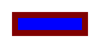

# toy-engine

follower of [Let's build a browser engine! Part 1: Getting started](https://limpet.net/mbrubeck/2014/08/08/toy-layout-engine-1.html)

## example

```
node_modules/.bin/ts-node example/toy-engine.ts --css=example/color.css --html=example/color.html --width=200 --height=100 | feh -
```



```example/color.html
<html>
  <body>
    <div class="outer">
      <div class="inner"></div>
    </div>
  </body>
</html>
```

```example/color.css
* { display: block; padding: 12px; }
.outer { background: #800000; }
.inner { background: #0000ff; }
```

## references

- [Let's build a browser engine! Part 1: Getting started](https://limpet.net/mbrubeck/2014/08/08/toy-layout-engine-1.html)
- [mbrubeck/robinson](https://github.com/mbrubeck/robinson)
- [sanemat/js-toy-engine](https://github.com/sanemat/js-toy-engine)

## badges

[](https://github.com/prettier/prettier)
[](https://greenkeeper.io/)
[](https://circleci.com/gh/sanemat/ts-toy-engine)
[](https://david-dm.org/sanemat/ts-toy-engine?type=dev)

### NPM scripts

 - `npm t`: Run test suite
 - `npm run lint`: Lints code
 - `npm run prettier`: Formats code
